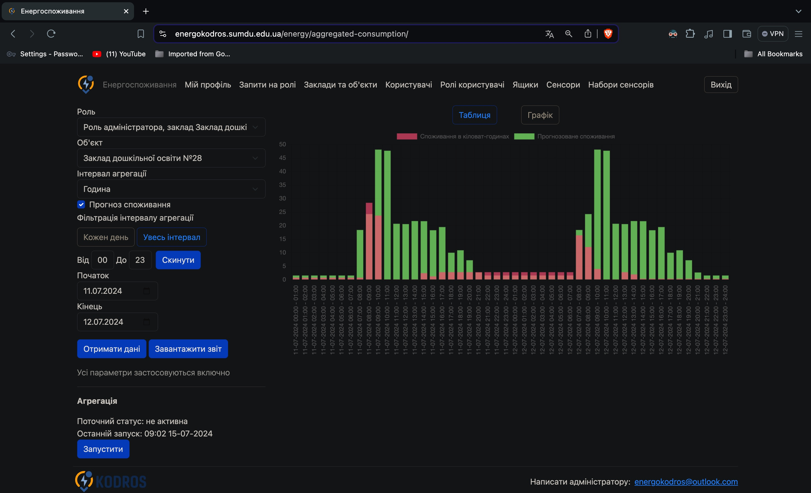
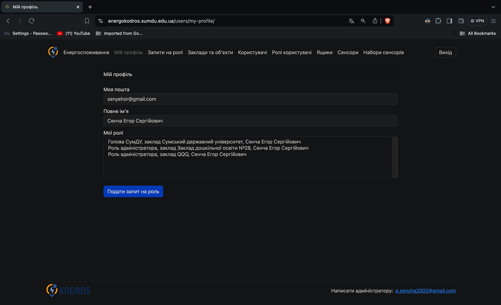
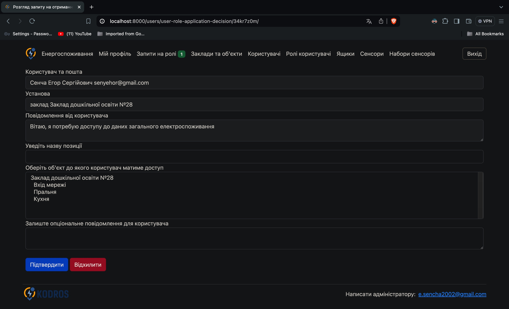
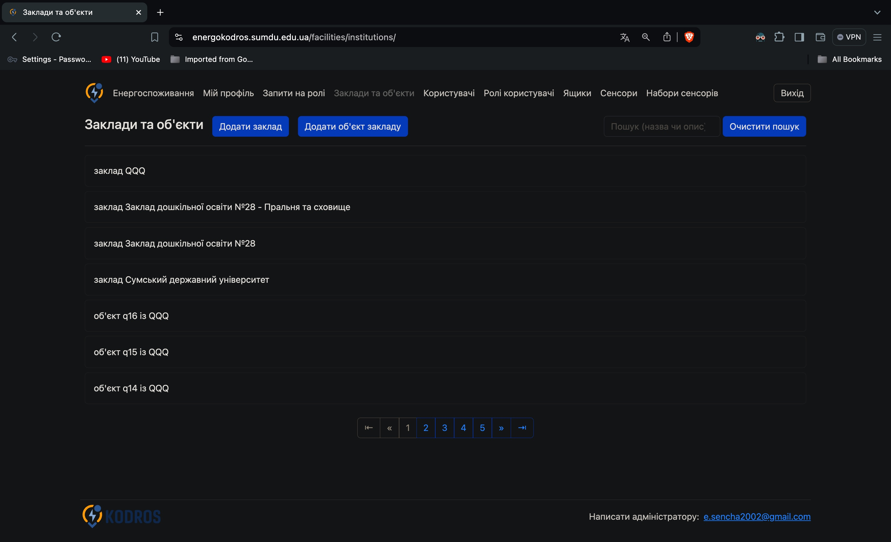
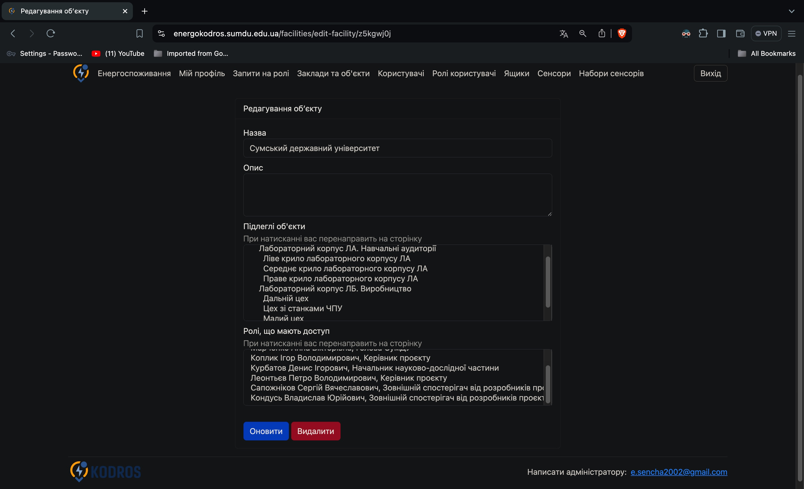

Hi! Today I'd like to introduce you to a website I developed as part of the electricity consumption monitoring system energokodros.sumdu.edu.ua. It is a general functionality overview, with no technical details and nothing complex. However, I will write an article covering interesting technical details of the realization, including both Django-specific and general Python tips and tricks.

Let's start with the main page. It fulfills the main goal of the system, which is to provide users with aggregated consumption data. On the left, you can see the query parameters form, enabling users to filter desired data deeply, buttons to see consumption on the site, or download .docx report. On the right, there is a data representation block where users can see consumption in either a table or graph. And the last important element of this page is the button to start aggregation, which allows you to get access to the most recent data after aggregation is finished.

Another page available for a regular user is "My profile". There can be found their personal info, a list of available roles, and a button to apply for a new role. There is a dedicated page to review role requests, but it is administrator functionality, so let's see it in the next paragraph. 

Role application review page has some request data, like who is applying for a new role, which organization he or she applies to, and an application message. Then, the administrator can set what facility the user will have access to, leave a message for the user, or simply decline the application. In both cases, the user will get an email with the request review results, including a message from the administrator for them.

Here is the page to manage institutions and their facilities. It provides administrators with the functionality to view, search entities, has convenient buttons to add a new institution or facility,  search and navigate results using pagination. All the rest of the management pages are very similar, providing view, search, edit, delete and go to related functionality for system entity groups. On a click on a facility we go to the details page, so let's see it.

This page contains all of facility info, and gives a convenient interface to update some data or go to a related object just by clicking on it. Also, it allows deleting a facility.

Thank you for your attention. I hope it helped you understand what I created better.