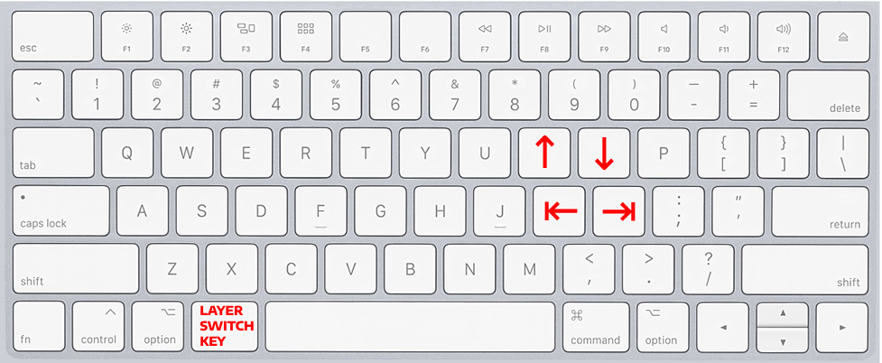
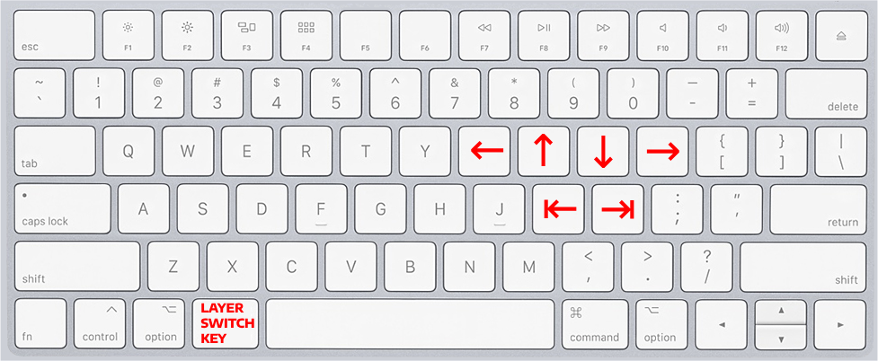
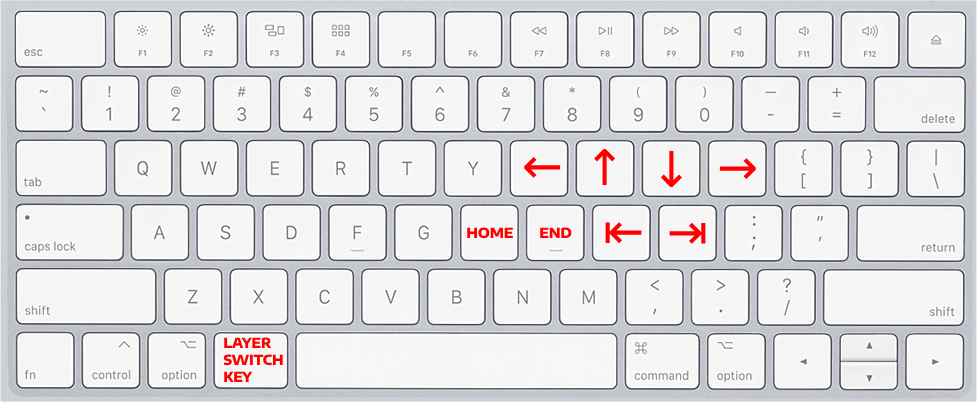
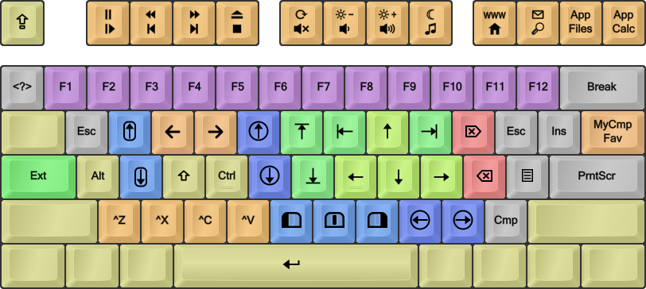

# Still use arrows to navigate code? You are missing out

I am happy to introduce you to be the best approach to navigate edit code I found so far. It was a struggle that in order to use arrows, `HOME`, `END` and some other keys in their default position on a keyboard, because I had to move my hand too ofter. So, I came up with the idea to eliminate redundant hand movement as much as possible. The main purpose of the guide is to make you think in the right direction, feel free to alter any particular keybind as you like, but I will provide some foundation to build upon.

I used a concept called "layers" in world of programmable keyboards - you can think of `SHIFT` to be a key that toggles a layer, giving access to capital letters and so on. As I grew from windows-oriented keyboard, I started using `left ALT` key to function as "layer switch", binding nessesary key to be some combination of `left ALT + SOME_KEY`. This is the main point of the guide - to suggest you start using the same approach. In the text below by binding, for example, `HOME` to letter `H`, I will mean that `HOME` key is sent to the computer, when `THE_KEY_YOU_WILL_CHOOSE_TO_TOGGLE_LAYER + H` is pressed.

Let's start with arrows. The goal was to minimize hand movement using common navigation keys. I chose my right hand default position (index finger on `J`) as anchor point. This is because I find the most comfortable to use my left thumb to press `KEY_I_CHOSE_TO_TOGGLE_LAYER` (`left ALT` originally) and you will probably feel the same. From there I decided to bind `move one word forward` and `move one word backward` to letters `K` and `L`. This is the crucial tip, as I barely need to navigate per-symbol, and binding to `[option + (left/right) arrow] for macOS` or `[ctrl + (left/right) arrow] for Windows`, makes movement between words in a line so much more convenient and fast. This is truly game-changing approach and I am dead sure it will make your worksflow much more enjoyable. Then, I bind `arrow up` to `I` and `arrow down` to `O`. These are two keys that are very easy to reach and this binds seem logical to me.

Despite per-symbol movement being used less often, we still need it. This particular keybind is a little bit trickier, as I see two ways to bind them. Here I cover basic variant, but an advanced one will be in **implentation**. We need to place them relatively close to default hand positon, but can affort to move our fingers further in order to reach them. So, I suggest to use `U` for `LEFT_ARROW` and `P` for `RIGHT_ARROW`.

Here we got to second group of keys I use the most: `HOME` and `END`. They are usually placed very far from default hand position on. So, I bound `END` to `J`, as i use it very often and `J` requires no movement from default hand position. Then, I bound `HOME` on `H`, as it is still quite close to default hand position but further that `J` - because I use `END` more often than `HOME`. Plus it seems logically appealing to bind `H` (on the left - `HOME` - cursor moves to the left) and `J` (on the right - `END` - cursor moves to the right).

That is it for the very basics, and it is the perfect start into improving your code editing and navigation. I will cover more advanced bindings in later articles, so you might follow not to miss it.

### Implementation

Summing up, you will need to setup 2 group of keys:
- `UP/DOWN/RIGHT/LEFT` arrows and `MOVE ONE WORD FORWARD` / `MOVE ONE WORD BACKWARD`, choosing shortcut according to your system.
- `HOME` and `END` keys

For **MacOS**

I found [Karabiner](https://karabiner-elements.pqrs.org/) + [Goku](https://github.com/yqrashawn/GokuRakuJoudo) to be the best option for system-wide shortcuts, plus it seems to be quite explicitly configurable. [Here](https://gist.github.com/gsinclair/f4ab34da53034374eb6164698a0a8ace) is some gist example setup and some pitfalls discussed.

Another option is to use IDE shortcuts, but you might get overlaps with some system `COMMAND + KEY` shortcuts, if you choose to use `LEFT COMMAND` to be `LAYER_SWITCH_KEY`. There is a workaround, switching `COMMAND` and `OPTION` keys inputs with each other, but it will be system-wide, so you'll need to get used to new keys positions. Also, you will need to disable special symbol inputs with `OPTION + KEY`, modifying `~/Library/Keyboard Layouts/`, [here](https://apple.stackexchange.com/questions/388552/macos-how-to-turn-off-option-key-printing-special-characters-in-vs-code-intell#answer-461625) is an easy solution I successfully tried.

For **Windows**

[DreymaR's Big Bag Of Keyboard Tricks - EPKL](https://github.com/DreymaR/BigBagKbdTrixPKL#can-i-map-the-caps-key-to-backspace) is a superior option over all other windows alternatives. It provides deep customization, but it comes at a cost of added complexity, but nothing too geeky. Big plus is having a pre-made [layer](https://dreymar.colemak.org/layers-extend.html) that is quite close to what i propose to use, so you do not have to start everything from scratch.

If you are not ready to commit that much yet, it is still possible to just use IDE shortcuts. They are easy to setup, as `ALT + KEY` do not override any system shortcuts.

**Advanved `LEFT/RIGHT arrows` binds**
 
I find it more logically appealing and overall easier to use when I have mine `LEFT arrow` / `RIGHT arrow` directly under `MOVE ONE WORD FORWARD` / `MOVE ONE WORD BACKWARD`. It can either be done either via having additional layer in corresponding software, or by using some additional modifier key in IDE shortcuts, like having `Ctrl + THE_KEY_YOU_WILL_CHOOSE_TO_TOGGLE_LAYER + THE_KEY_TO_MOVE_ONE_WORD_FORWARD`. But it might get tricky to select text per-symbol, in case with choosing IDE shortcuts, so I do no recomment doing so.